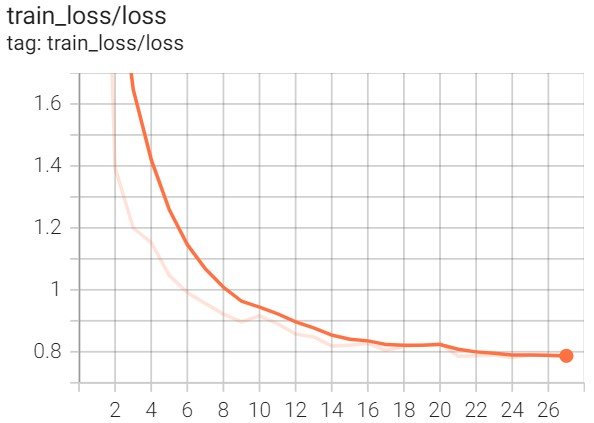
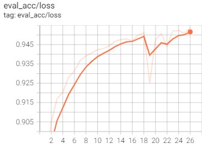

# CRNN
An implementation of CRNN algorithm using Pytorch framework

The most typical CTC algorithm is CRNN (Convolutional Recurrent Neural Network), which introduces the bidirectional LSTM (Long Short-Term Memory) to enhance the context modeling. Experiments have proved that the bidirectional LSTM module can effectively extract the contextual information of the picture, finally enter the output feature sequence into the CTC module, and decode the sequence result.

<p align="center">
    <image src="images/CRNN.png" width=500px>
</p>
Environment
The dependencies are listed in `requirements.txt`. Please install and follow the command below:

```bash
pip install -r requirements.txt
```

## Data Preparation
You can download and use [ICDAR2015]() or [MJSynth]() dataset for the training model. 

After that,
+ Put the data folder under the `datasets` directory
+ Setup config file for each dataset in `src/__init__.py`: replace `CFG_PATH` augment by `src/config/rec_lmdb.yml` or `src/config/rec_icdar15.yml`

## Training
Before training, please modify configurations in `src/config/rec_lmdb.yml` or `src/config/rec_icdar15.yml`
```bash
python -m src.train
```
To train the model with PyTorch lightning
```bash
python -m src.pl_modules.pl_train
```
## Evaluation
```bash
python -m src.eval
```

## Export model
```bash
python -m src.exports.exporter --export_format <torchscript/onnx/paddle/tensorrt> --device cuda
```

## Prediction
```bash
python -m src.predict --img_path <path_to_image_file> --export_format <torchscript/onnx/paddle/tensorrt> --device cuda
```
Example:

<p>
    <image src="images/tuongan.png">
</p>

```bash
python -m src.predict --image_path images/tuongan.png --export_format pt --device cuda
>> tuongan
```

## Tensorboard

```bash
tensorboard --logdir debugs/tensorboard
```

| Train Loss | Valid Loss | Valid Acc |
|--|--|--|
| <p align='center'></p> | <p align='center'></p> | <p align='center'></p> |

## Experiments

| Export format | Inference time| ACC with CTCLoss| ACC with Focal CTCLoss | 
|---|---|--|--|
| Pytorch | 0.0008s | 95.47 | 96|
| TorchScript | 0.0007s| - | - |
| ONNX | 0.001s| - | - |
| TensorRT | 0.0001s | - | - |
| Paddle | 0.01s| - | - |